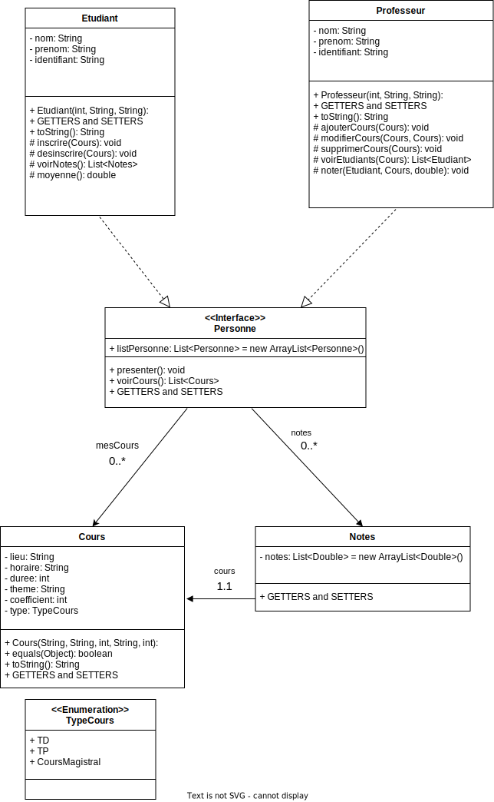
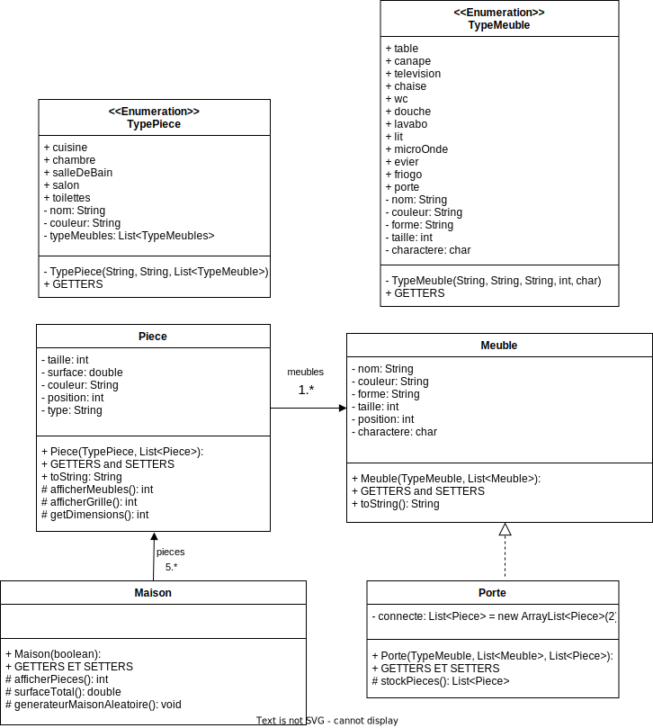

# EXERCICE 1 - Système scolaire

**Principe de base :**

Dans cet exercice, nous allons modéliser un établissement scolaire
composé de personnes pouvant être soit des étudiants soit des professeurs.
Un étudiant possédera : un nom, un prénom, un identifiant, la liste des
cours auxquelles il est inscrit ainsi que la liste des notes reçues pour
chacun de ses cours. Et pourra se présenter, s'inscrire ou se désinscrire d'un
cours, visualiser ses cours et ses notes ainsi que calculer sa moyenne.
Un professeur, quant à lui, possédera aussi : un nom, un prénom, un
identifiant, ainsi que la liste des cours qu'il propose. Celui-ci pourra se
présenter, visualiser la liste de ses cours, ajouter, modifier ou supprimer un
cours, voir la liste des étudiants inscrits pour un cours donné, ou attribuer
une note à un de ses étudiants.

Un cours sera caractérisé par : un lieu, un horaire, une durée, un thème, un
coefficient et un type (TP / TD / Cours magistral)

**Question :**

1 Représenter le problème suivant sous forme de diagramme de
classe

2 Implémenter les classes Etudiant, Professeur et Cours ainsi que
l'interface Personne, classe mère de Professeur et Etudiant.
Utilisez une énumération pour gérer les types de cours.

3 Répondre via un commentaire dans le fichier en argumentant
votre réponse. Que pensez-vous de l'utilisation d'une interface
pour gérer le concept de personne ?
Ce choix est-il judicieux ?
Pourquoi ?

Le Choix d'une interface est une bonne utilisation ici car elle permet d'utilisé des méthodes par défauts et d'avoir la liste de tous les etudiants accessible par les professeurs grace au mot cles static.
Cependant ce n'est pas selon moi le meileur choix possible.
En effet il n'est pas possible dans une interface d'avoir des variables alors qu'ici les nom, prenom et identifiant et mesCours sont des variables communes dans Etudiant et Professeur.
Et les getters et setters sont ici uniquement des prototypes de part cette limite, alors qu'ils sont identique dans les 2 classes fille et pouraient très facilement être initialisé dans la classe mère.
Il aurrait donc mieux vallu utilisé une classe abstraite cela aurait permis de déclarer les variables nom, prenom et identifiant et mesCours dans la class mere Personne.

4 Proposer un jeu de test dans votre main permettant de tester les
différents scénarios possibles.

# EXERCICE 2 - Maison Virtuelle
 
**Principe de base :**

Dans cet exercice, nous allons modéliser virtuellement une maison. Cette
maison contiendra un ensemble de pièces à savoir : une cuisine, une
chambre, une salle de bain, un salon et des toilettes. Selon les maisons
certaines pièces pourront ou non être répétées. Chaque type de pièce
possédera une taille, une surface, une couleur, une position au sein de la
maison ainsi qu'une liste de meubles qui lui est propre. Concernant les
meubles, chacun d'eux possédera un nom, une couleur, une forme, une
taille, une position ainsi qu'un caractère permettant de le représenter. 

Dans chacune des pièces, nous retrouverons :

* Le salon : une table, un canapé, une télévision ainsi que des chaises
* La cuisine : un micro-onde, un évier, un frigo
* La salle de bain : la douche, un lavabo
* La chambre : un lit
* Les toilettes : des WC

Chaque pièce possédera aussi un objet spécifique appelé « porte »
permettant de faire le lien entre 2 pièces.

**Question :**

1 Modéliser ce problème à l'aide d'un diagramme de classe.

2 Développer les classes évoquées dans l'énoncé en prenant en compte
les indications suivantes :

Chaque pièce pourra afficher la liste de ces objets, et s'afficher sous
forme de grille en représentant chacun de ces meubles.

La maison, quant à elle, pourra afficher l'ensemble de ces pièces en
affichant pour chacune leur nom, leurs dimensions et leur visuel. Elle
pourra aussi afficher sa surface totale.

Les meubles auront les tailles suivantes :
* table / douche / lit (carré / taille 4),
* canapé / frigo (rectangle / taille 2),
* autres objets (taille 1)

3 Coder l'objet « porte » héritant de meuble et permettant de stocker les
2 pièces qu'elle connecte. Pour déterminer le nombre de portes que
doit avoir chaque pièce, basez-vous sur la collection utilisée pour
stocker celles-ci au sein de la maison. Une pièce aura donc un
nombre de portes déterminé selon son nombre d'éléments voisins.

4 Une personne peut donc visiter la maison, en se déplaçant dans les
différentes pièces en choisissant à l'aide d'un menu la porte à ouvrir,
afficher la liste des objets présents dans la pièce, ou les
caractéristiques de celles-ci. Développer la fonctionnalité suivante
dans votre main.

5 Bonus (Pour les maîtres du Java)
Développer un générateur aléatoire de maison pouvant concevoir
diverses maisons dans lesquelles on retrouvera toujours les pièces de base, mais où il sera possible d'avoir plusieurs salles de bain / chambres voire d'autres pièces et d'autres objets.

# EXERCICE 3 - Médiathèque
 
**Présentation :**

Dans cet exercice, nous voulons simuler une médiathèque, lieu proposant des livres, des CD et des DVD. Pour cela, nous allons suivre les consignes suivantes :

* Chaque document possède un nom et un identifiant.

* Un livre à un auteur, un éditeur, un titre ainsi qu'un type (BD, Roman, Manga, Journal, Nouvelle) et ne peut être conservé qu'un mois maximum.

* Un CD à un titre, un auteur, un compositeur et ne peut être conservé qu'une semaine.

* Un DVD à un titre, un studio de développement et comme pour un CD, il ne peut être conservé qu'une semaine.

Les abonnés peuvent emprunter jusqu'à 3 documents et consulter ceux qu'ils n'ont pas encore rendu. Attention tous les documents ne peuvent pas être empruntés, certains seront uniquement disponible sur place.

Seuls les membres du personnel ont le droit d'ajouter de nouveaux documents ou de rendre certains indisponibles pour cause de rénovation.

**Question :**

1 Représenter sous forme de diagramme de classe ce problème 

2 Coder les différentes fonctionnalités en utilisant de la POO. Faites attention aux cas d'erreurs potentielles.

3 Dans votre main, réaliser un jeu de test permettant de valider vos différentes fonctionnalités. Pour rappel, un jeu de test ne doit pas permettre à l'utilisateur de tester votre programme mais plutôt montrer les différents cas que vous avez vous même testé. Pour réaliser cela, vous êtes libre d'utiliser une technologie comme JUNIT ou de les faire à la main dans votre main. Chaque test doit avoir un commentaire précisant le cas à tester (cas normal ou particulier), exécuter les méthodes nécessaires et afficher les résultats obtenus en console.

# Auto-Évaluation :

**Lisibilité du code** : 1/1

**Commentaire** : 1/1
* J'ai essayé d'uniformiser les commentaires mais ils restent encore un peu différent surtout d'un exercice à l'autre ce que je corrigerai au prochain tp. J'ai quand même supprimé tous les commentaires vide.

**Modélisation** : 2/2
* J'ai pris en compte tes remarques pour les flèches, les attributs dans les classes ne sont représenté que par les flèches et j'utilise son nom plutot que son type

**Pertinence des tests** : 1/2
* Je ne suis pas très fiere de mes tests notamment ceux pour tester les boucles dans lequels le Scanner reste actif tant que != "RETOUR"
* J'ai essayé d'utilisé des exceptions dans les tests mais là encore c'est pas jolie jolie, comme tu peut le constater à des moment j'utilise fail() et d'autre MonException() ... bref c'est pas claire et je vais approfondir mes connaissance la dessus.
* Il manque encore beaucoup de test pour vraiment dire que je couvre tout le projet
* Ah oui petite question qui me vient j'ai modifié les portées de mes methodes de protected à public (car les tests ne sont pas dans le même package et sinon j'avai une erreur de visibilité : The method ... from the type ... is not visible) est ce que c'est normal de devoir modifier la portée juste pour des tests ou bien c'est que de base je n'est pas bien compris le sens des portées ??

**Ajout perso** : 2/2 
* J'ai ajouté des exceptions comme demandé dans le tp précedent
* J'ai ajouté quelque generateurs de donnés aleatoires en plus de la question bonus de l'exercice 2

**Avancement du TP** : 4/4
* Tp terminé

**Bonne implémentation des concept vu en cours** : 3.5/6
* Je ne maitrise pas encore tres bien les enums. Exemple pour la partie choix d'action de la mediatheque je voulais utilisé le string associé à l'enum Choix pour ensuite faire un switch case, mais impossible car le case n'accepte que des constante, donc je me retrouve avec de if else (-1 en mauvaise pratique :( )
* l'heritage est clairement pas encore bien maitrisé car j'utilise encore beaucoup trop de conditions et de boucle au lieu de laissé faire JAVA ...
* Je ne sais pas pourquoi mais la porte dans la maison virtuelle ne me plais pas du tout, il y à d'abord un enum d'un côté puis un heritage de l'autre je trouve ça alambiqué

**Bonne pratique** : 1/2 
* beaucoup de boucle imbriqués notament avec les exceptions et les try ... catch que je ne maitrise pas du tout

**Mauvais pratique** : -1/-2
* if else au lieu de switch case
* else vide

TOTAL : 14.5

# CORRECTION - EXERCICE 1

Alors commencons par le diagramme
Du coup on a l'interface personne avec voir cours + se presenté ca me semble pas mal.
Après par contre j'ai pas compris les getter / setter etant donner qu'une interface ne peut avoir que des constante. Et je vois une liste de personne je sais pas trop a quoi cela fait reference.
D'ailleurs petit precision (vu que j'ai pas encore mis a jour le cours sur les differents type de classe) mais une interface ne peux avoir que des constante et en soit il existe 2 groupe de constante.
Les variable que tu as definis comme constante via le mot clé final. Et les constante numerique comme PI, ou ce genre de chose qui sont aussi des variable final la seul difference c'est que les constante numerique ont un contenue connu et affecter des leurs declarations ce qui n'est pas le cas des autres constante que tu creer toi même comme un nom prenom date de naissance ta besoin de l'info useur donc tu les declare puis initialise. Du coup dans les interface seul les constante numerique (celle ou on connait la valeur avant de demarré le programme) sont autorisé.
Après dans ton cas je sais pas trop a quoi cela sert mais la variable est statique donc commun a toutes les personne ce qui est aussi autorisé.

Ensuite on a Etudiant et proffeseur qui dont des personne.
Ici ta des proter protectetd je vois pas trop a quoi cela sert car en soit ces classe n'ont pas d'enfant donc tu pouvais les mettre en publique.
Chaque personne a des cours chaque cours a une notes.
Ok je vois l'idée mais ta quelque probleme dans le schéma en gros c'est bien pensé mais mal representé.

Alors ici ta etudiant et professeur qui pointe vers personne c'est ok c'est les bonne fleche et mise a par les porté protected qu'on comprends pas trop c'est ok.
Par contre cours doit etre relié a la fois a etudiant / proffeseur car en soit ici personne est une interface donc a moins d'avoir une var statique liste de cours tu peux pas la relié et ici c'est pas le cas. (En gros c'est a cause de l'interface dans ce cas la spoiler mais c'est pas adapté)
En suite pareil pour note mais ici faut le relié que a etudiant fin tu peux aussi mettre a professeur mais en soitr est que qu'il ont des note je suis pas sur. Et ta note relié a cours ca j'ai pas vraiment compris pourquoi car au final c'est l'etudiant qui a les notes / et une moyenne en fonction de ces cours et c'est le prof qui la met en fonction des etudiant ecris a ces cours fin je vois ca comme ca.
Et du coup l'enumeration bas tu peux la relié a cours et metre type sur la flèche et le supprimer de cours.
D'ailleurs ici ce n'etait pas demandé dans l'exo car la classe principale sert juste de jeu de test) par contre petit conseil si j'amais dans ton UML ta un objet non relié au autre ou que ta classe principale sert a lancer ton programme (ce n'est pas un jeu de tests) je te conseil de codé un objet principale par exemple ici etablissement ou ecole ayant pour but de regouper tout tes objets ;-)
Donc voila tu peux le faire tout le temps c'est pas faux après quand ta que des jeux de test c'est pas non plus super grave si tu oublie après quand tu fais un jeu ou autre bas c'est pas mal d'avoir une classe Jeu qui regroupe tout et un main dans cette classe ou a part qui construit justement ce jeux en fonction des saisie faite par l'utilisateur genre son nom s'il veut jouer contre un IA...
Voila petit conseil pour la suite.
Passons au code

--TypeDeCours
Ok ya l'enumeration demandé et c'est bien fait.

--Cours
Pour les attributs ya tout et pour les methode un constructeur, un toString + un getter et setter pour chaque attributs. Ok c'est propre.

--Notes
Ok alors ici tu as decidé de créer un objet pourquoi pas.
En attribut ta le cours concerné / la liste des note au format double c'est bien pensé.
Et pour les methodes c'est assez basique.
Après je ne voit pas de m"thode pour ajouter une note j'aimgine que ca doit se trouvé dans professeur.

--Personne
Alors la reponse concernant l'interface (ya mieux) est correct.
Après ici l'attribut liste de personne est un peux bizarre je n'ai pas encore bien compris a quoi sert l'attribut mais je pense qu'il ne doit pas etre au bon endroit. Si je me fie a ton commentaire c'est une liste des etudiants ? Du coup je vais t'expliqué pourquoi ce n'est pas vraiment correct. Alors une variable statique sous entends que toute variable de cette classe (instance) on la même tu peux imaginé une variable non statique comme un bien propre a une variable de cette classe et une variable statique comme un bien commun donc ici tout les personnes auront la meme liste.
Après la 2e chose c'est au niveau de la traduction une personne est quelque chose de réel doc on peut prendre exemple sur la réalité est ce qu'une personne a une liste d'autre personne ca a pas beaucoup de sens x)

Concernant les methode tu as utilisé des annotation ce qui permet de genere de la doc auto -> super.
Sinon je vois que tu as utilisé des methode par defaut (ce que je n'ai pas encore presenté dans le cours manque de temps / volonté donc toujours pas update) En tout cas le choix est interessant pour presenter, voirCours, indexCours, deja. Bon deja le nom est pas super bien choisi mais ya le commentaire qui explique.
Après petit conseil perso quand tu vois une interface avec des getter et setter (juste des prototype) c'est surement que l'interface est pas adapté ;-)

--Etudiant
Ok pour les attribut de etudiant après ici tu n'a pas d'etablissemnt / ecole qui regroupe le tout ce qui aurait ete interessant. Et ce qui permet de ne pas repete les sous objet dans plusieurs objets (cours dans etudiant / prof) avec ce type d''architecture ce que tu peux faire c'est avoir la liste des personne (etudiant / prof) + la liste des cours ensuite chaque etudiant / prof a une liste d'indice indiquant leurs cours (clef etrangère comme un BD) ce qui evite de repete des objet et evite de surcharger la memoire. Donc voila une petite optimisation.
Sinon constructeur / getter et setter c'est ok
Alors pas bete l'idée de verifier le cours pour ne pas avoir de doublons j'y avait pas pensé mais du coup ya plus optimiser ;-)
Tu as fait un equals dans cours du coup tu peux faire un set au lieux d'une arrayList par defaut tu peux les ordonné par ordre alpha en fonction du theme ou ajouté un id (donc methode de trie par defaut) l'avantage c'est que le set / trieSet ne permettent pas l'ajout de doublons.
Après pour voirNote j'ai pas compris pourquoi ta methode retourne quelque chose, ni pourquoi elle est en protected vu que ta classe n'a pas de classe fille ya pas vraiment d'interet.
Du coup ta fais une methode pour la moyenne generale mais pas pour la moyenne de chaque cours ? Petite astuces si tu voulais la faire ce que je te conseil c'est de le faire dans cours. Puis apres dans etudiant tu aura juste a faire ton for each puis note.calculMoyenne() afin de tout additionne puis divisé.
Et pour finir j'ai pas compris l'interet de dejaNotes si ta dans personne deja qui fait la même chose a moins que je me trompe.

--Professeur
Meme remarque pour l'attribut cours que pour etudiant.
Pour les methode ici cela semble pas mal et du coup ya pas de methode deja :P

--Main--
Alors pour le jeux de tests n'hesite pas a faire un affichage avant apres par exemple pour ajoute cours qu'on puisse bien verifier car succes c'est cool mais fautr voir le code ou faire confiance à l'auteur :9
Pour les jeux de tests tu peux regroupé les test par exemple voir les etudiant cours java (3) / python (4) au final tu peux considéré que c'est le même test ya juste le nombre d'etudiant qui change et le nom du cours et en soitr ya deja plusieurs etudiant pour le premeir tests.
Après par contre pour ajouter note c'est differents car ta le cas une note / plusieurs et il peut arrivé parfois que pour plusieurs il y ai des probleme.
Bon sinon le jeux de tests semble pas mal c'est bien aussi d'avoir fait des methode pour chaque tests. Et c'est un vrai jeu de test je sais pas si je t'ai donné la precision donc je la rajoute.
Ya 2 type de test les tests unitaire qui servent a tester que chaque fonctionnalité que ta codé marche bien et qui peuvent etre faite dans un main pour chacune des classe et le jeu de test qui lui va pas testé toutes les fonctionnalité mais plutot comme ta fais des mini scenario qui pourront survenir lors de l'utilisation. La on s'en fou setName ou ce genre de methode.

# CORRECTION - EXERCICE 2

Alors le schema.
Alors deja je vois 2 enumeration une pour les pieces et une pour les meuble j'ai envie de te dire que c'est une super idées (perso j'ai pensé aussi comme ca) mais pas forcement tes camarade qui pour la plus part mon codé plein de classe pour chaque objet ce qui n'est pas faux non plus. Après dans ton schema faut les relié tes enum aux classes qui les utilise (meuble / pieces)
Après je vois qu'il y a un meuble special porte. Ta aussi des pieces qui possède une liste de meubles ouai c'est pas mal et une maison (objet principale) qui a une liste de pieces.
Alors l'aspect generale semble pas mal a voir le code après ta encore les protected un peut partout alors que tes classes n'ont pas de fille. La seul c'est meuble qui a porte mais meuble n'a pas de methode protected xD
Passons au code.

--TypeMeuble
Alors pas mal l'enumeration.
Après pour les caractère c'est ton choix le charAt juste que tu en a certain qui seront identique par exemple table / tele.
Mais en soit moi dans l'exo je m'en fou. Sinon le reste du code c'est clean.

--Meuble
Alors la j'ai pas compris l'idée en soit ton enumeration codais deja tout tes meubles et dans lenoncer ils ont des attribut precis / fixe connu des le debut donc en soit ton enum etait une bonne idée. Après j'ai pas trop compris pourquoi tu l'utilise pas directement genre pourquoi tes pieces ont pas deja une liste d'enum.

--Piece / TypePiece
Meme remarque que pour les meubles.
J'ai pas trop compris l'idée la tu n'as pas utilisé l'enum pour gere un attribut mais tout l'objet alors pourquoi en avoir fait un autre après ?
C'est surement pour ca que dans ton diagramme tu n'avais aucune fleche avec tes enum c'est tout simplement quelle sont en trop. Ici tu peux utiliser direct les 2 enum / ou directement les 2 classes mais pas besoin des enum + classe.

--Porte
Après ici c'est possible que tu ai un probleme via l'heritage si meubles sont directement des enum. Moi en soit j'avais plus ou moins une idées similaire a la tiennes j'ai porte et meubles (une classe generale avec des params differents pour n'importe quel objet et pas une classe pour chaque)
Bon ya pas grand chose c'est ok.

--Maison
Ok pas mal ya meme un generateur bon c'est pas le meilleurs mais bon c'est deja mieux que rien. Pour ma part j'ai un dico pour chaque pieces avec un nombre min / max et le random choisi un chiffre pour chaque pieces compris entre la borne histoire d'etre sur d'avoir au moins toilet chambre salle de bain cuisine.

--Main
Alors ici quelque conseil opti / semantique.
Quand ta une boucle ou tu rentre au moins une fois a l'interrieur pense au do while (je parle pour ta saisie -> il sert a ca) meme si en soit ce que ta fais est juste. 2E conseil dans ton menu je te conseil de mettre a l'avenir 1 -> Meuble / 2 -> pieces...
Mettre un chiffre ou une lettre devant chaque proposition moins ta de truc a tapper moins on risque de faire une erreur de frappe. Sinon le switch est une bonne idées.
Et tu es pas obliger d'avoir de default case surtout si elle fait rien.
En parlant d'erreur de frappe tu propose de copier coller plus pratique moi j'ai tappé et j'avais meme pas vu les majuscule au debut. Du coup dans ton defaut case tu peux mettre un truc genre le choix demander n'existe pas veuillez recommence.
Mais bon reduire la saisie c'est a faire la prochaine fois.

Sinon l'execution est pas mal dommage que tu n'est pas proposé de visualisé la pieces il me semble que tu l'avais codé genre afficher une matrice avec les caractere des objets dans les case non vide.

# CORRECTION - EXERCICE 3

Alors Tu as creer une mediathèque, qui possède une liste de membre et de documents.
Parmis ces document il y as des DVD / des livres / des CD.
Par contre tes enumeration ne sont pas relié a livre / membre (il manque les flèche de possession avec le nom de l'attribut sur la fleche)
Et je vois une execption par contre ici qon nom est mal choisi vu qu'on ne comprend pas vraiment a quoi elle sert et il lui manque son constructeur.
Sinon ta toujours le probleme des methode protected mais le reste semble pas mal.

--MonException
Bon bas ici ce qui ne faut pas faire le nom de l'exception est pas clair
On c'est pas vraiment a quoi elle sert on doit regarde dans le code pour comprendre.
La prochaine fois essaye de trouver un nom plus clair. Sinon niveau code c'est pas mal en plus tu as choisi de mettre un message d'erreur perso ce qui est la bonne procedure pour que le useur puisse comprendre ce qui a mal fait.

--TypeMembre.
Ok pourquoi pas tu gere la differences entre membre et personnel via une enum.
A voir si cette fois c'est mieux utilisé :9.

--Document
Documents est pas mal ta meme fais des fonction pour calculer la date de retour et les retard un bon point.

--Categorie
C'est bien utiliser.

--CD / DVD / Livre
C'est clean et ta meme @verride les methode necessaire.

--Choix
Ok du coup tu as fait une enum pour leiste les actions possible pourquoi pas a voir comment c'est utilisé.

--Membre
Alors ici l'enum est correct du coup manque juste la fleche dans l'uml.
Ah et de ce que je vois la mediatheque semble etre une classe statique en soit sa marche mais c'est dommage tu aurais pu en faire un objet (classe principale du programme).
Alors la methode pour rendre les documents j'ai compris l'idéee c'est pas mal mais la c'est lourd ya moyen d'optimiser on voit plein de catch differents dans la boucle puios les meme dans le finally. Et on comprend pas vraiment ton execption.
Bon j'avoue avoir mal compris la fonction avec tout ces catch et finally je vois pas vraiment ce que ca fait. On demande a la personne tout les documentsd qu'elle veux rendre mais apres aucune idées.
On arrive enfin a ton exception ok je vois l'idée. Du coup tu pouvais l'appeler DocumentException ou empruntException ce serait plus clair.
Après du coup conseil amelioration pour tes document tu peux faire un dico (hasmap) comme ca chaque document a son ID il suffit de faire dico.get(ID) du coup sa rend plus rapide le parcourt. Après avec cette technique ou ta liste ce que tu pouvais faire pour simplifier le code de pas repete partout les execption erreur index c'est faire un do while repete tant que sa reponse c'est pas arrete / et tant que son indice est pas compris entre 0 et taille de liste.
Bon mise a part que j'ai du mal a comprendre le but des double finally (sans executé) le reste semble pas mal.

--Mediatheque
Bon au final ta mediatheque est une classe statique et non un objet ce serait plus interessant la prochaine fois d'en faire un objet.
Alors dans les switch pas besoin d'avoir des case vide default ou pas.
Alors je suis peut etre fatiguer mais j'ai du mal a lire le code.
Pour test if tu peux faire un dico avec key ton choix values tes fonctions.
https://stackoverflow.com/questions/4480334/how-to-call-a-method-stored-in-a-hashmap-java
Après par contre si ya des params j'ai jamais testé en Java du coup la tout de suite j'ai pas la reponse ^^'.
Après autre conseil dans un try tu as le droit de mettre toutes les instruction que tu veux alors je te conseil de mettre le tout meme si certaine instructions pose pas de probleme ce sera plus lisible et ca evitera ton double tryu catch dans actions().
En mettant plus de ligne tu rend le code plus lisible et tu reduit le nombre de block try / catch a 1.
Bon pour les saisie meme conseil que precedement je vois des copier coller je te conseil plutot des tapper 1 pour ca 2 pour ca...
Pour connection le return dans le void fait bizarre mais je vais le tolere.
Bon mise a par les grosse fonction avec plein de if / else / try catch finally que j'ai eu du mal a lire le reste ca va. Pour ce genre de fonction la prochaine fois n'hesite pas a decomposé en plusieurs fonction peut etre privé histoire que ce soit plus simple a lire ou a mettre des commentaire a coté de tes fially quand tu en a plusieurs qu'on sache a quoi il servent.

Execution
je crois avoir demandé un jeu de test et pas a testé le programme c'est plus rapide pour moi les jeu de tests car la je dois tout testé a la main ^^'
Bon bas au final les enum pour les action je pense tu aurait du mettre un string pour chaque action avec un nom ecrit normalement pour facilité la lecture des non info.
Bon ya au moins une fonction pour passé de l'abonne au membre facilement.
Je l'ai pas commenté mais le generateur c'est un bon point.
Bon sinon tout semble être ok niveau tests.

# NOTE ET COMMENTAIRE FINAL TP8 :

Alors apreciation gloable
Les diagrammes c'est pas mal mais pas encore parfait a revoir tes fleches.
Après niveau code c'est bien commenté, niveau lisibilité c'est pas trop mal mais ta des methode un peux compliquer a reduire via des sous fonction private ou publique et aussi n'hesite pas a commenté quand ta plusieurs block les un dans les autres (exemple des finally tray catch)
Certain nom son aussi a revoir afin qu'il soit plus comprehensible.
Sinon niveau heritage c'est pas mal a compris les extends / implementer / les methodes par defaut, classe abstraite et interface et les @verride par contre ya quelque soucis avec protected.
Protected ça permet de donné acces aux classe filles donc si ta classe n'a pas d'enfant (personne n'en herite pas besoin).
Sinon au niveau des objet c'est pas mal non plus malgré qu'il reste quelque truc a revoir comme les enum que ta codé comme des objet pour les recoder. Ou les objets stocker dans d'autre (cours dans eleve / professeur) pense au clef etrangere ne pas stocker l'objet mais un attribut permettant de le retrouvé.
Un autre truc a amelioré et celui la je veux le voir des le prochain TP simplifie tes saisie met des raccourci pour les option qu'on est pas besoin de copier coller :P
Sinon tout le reste non mentionne c'est ok (exeption par exemple...).
Passons a la note

Lisibilité du code : 0,75/1 j'ai eu du mal avec les der methode de mediatheque peut etre j'etais fatiguer mais bon c'etait pas super clair.

Commentaire : 1/1 -> bon bas la ca va un par methode ta mis des annotations et tout après n'hesite pas a en mettre sur les passage embigue

Modélisation : 1,5/2 -> c'est presque parfait mais ta encore des elements qui ne sont pas relié entre eux pourtant c'est pas des elements statique donc il devrait etre relié.

Pertinence des tests : 2/2 -> pour les test ceux du premier TP son bien et pour le 2e j'ai completement oublier que tu avais fait du Junit. Ok je viens de regarde il sont pas trop mal surtout que ta fais l'effort de faire du Junit. Après ici tu es pas obliger de tout testé perso je veux un jeu de tester que tu teste les fonctionnalité scenario possible pas besoin de teste unitaire ou tu teste toutes les methodes mais si tu m'en met bas c'est un +.

Ajout perso : 2/2 -> Tout les point en soit ta ajouter le generateur qui etait demandé en bonus et d'autre truc.

Avancement du TP : 4/4 -> tout a ete fait

Bonne implémentation des concept vu en cours => 3/6 -> alors ici c'est pas mal dans l'ensemble mais apres tu as encore quelque probleme que je pense niveau conception et moins code je pense que si tu arrive a mieux imaginé tu le codera sans trop de soucis. Pour les enum tu les a parfois bien utilisé mais parfois non ca depend des exo. Après pour les exception c'est un bon debut c'est bien utilisé mais pas très jolie. Après pour le faite de laisser faire java ce sera plutot niveau polymorphisme du niveau de l'heritage l'utiliser au max c'etait plutot utiliser les sous type et super type comme personne pour regrouper etudiant / professeur d'ailleurs je me souviens plus trop si tu l'as fait.

Bonne pratique : 1/2 -> ici il y en as mais tout est pas optimiser non plus donc 1/2 pour l'effort.

Mauvais pratique : 0/-2 -> aucune la je parle des comportement interdit dans le cours , break de boucle, catch exception...

15,25/20

Ah oui petite question qui me vient j'ai modifié les portées de mes methodes de protected à public (car les tests ne sont pas dans le même package et sinon j'avai une erreur de visibilité : The method ... from the type ... is not visible) est ce que c'est normal de devoir modifier la portée juste pour des tests ou bien c'est que de base je n'est pas bien compris le sens des portées ??

Pour repondre a ta question oui / une portée publique est trouvable d'un package (dossier) a l'autre, private package ne sort pas du package / protected de la famille (heritage des classe qui herite de celle qui a l'element protected seul les filles pas les meres) / private de la classe (fichier)

