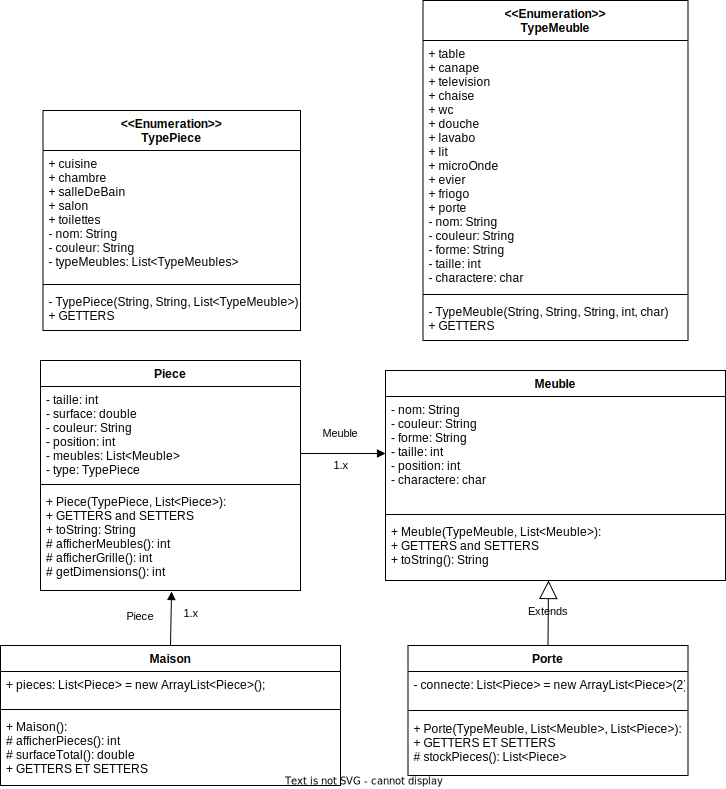

# Maison Virtuelle
 
**Principe de base :**

Dans cet exercice, nous allons modéliser virtuellement une maison. Cette
maison contiendra un ensemble de pièces à savoir : une cuisine, une
chambre, une salle de bain, un salon et des toilettes. Selon les maisons
certaines pièces pourront ou non être répétées. Chaque type de pièce
possédera une taille, une surface, une couleur, une position au sein de la
maison ainsi qu'une liste de meubles qui lui est propre. Concernant les
meubles, chacun d'eux possédera un nom, une couleur, une forme, une
taille, une position ainsi qu'un caractère permettant de le représenter. 

Dans chacune des pièces, nous retrouverons :

* Le salon : une table, un canapé, une télévision ainsi que des chaises
* La cuisine : un micro-onde, un évier, un frigo
* La salle de bain : la douche, un lavabo
* La chambre : un lit
* Les toilettes : des WC

Chaque pièce possédera aussi un objet spécifique appelé « porte »
permettant de faire le lien entre 2 pièces.

**Question :**

1 Modéliser ce problème à l'aide d'un diagramme de classe.

2 Développer les classes évoquées dans l'énoncé en prenant en compte
les indications suivantes :

Chaque pièce pourra afficher la liste de ces objets, et s'afficher sous
forme de grille en représentant chacun de ces meubles.

La maison, quant à elle, pourra afficher l'ensemble de ces pièces en
affichant pour chacune leur nom, leurs dimensions et leur visuel. Elle
pourra aussi afficher sa surface totale.

Les meubles auront les tailles suivantes :
* table / douche / lit (carré / taille 4),
* canapé / frigo (rectangle / taille 2),
* autres objets (taille 1)

3 Coder l'objet « porte » héritant de meuble et permettant de stocker les
2 pièces qu'elle connecte. Pour déterminer le nombre de portes que
doit avoir chaque pièce, basez-vous sur la collection utilisée pour
stocker celles-ci au sein de la maison. Une pièce aura donc un
nombre de portes déterminé selon son nombre d'éléments voisins.

4 Une personne peut donc visiter la maison, en se déplaçant dans les
différentes pièces en choisissant à l'aide d'un menu la porte à ouvrir,
afficher la liste des objets présents dans la pièce, ou les
caractéristiques de celles-ci. Développer la fonctionnalité suivante
dans votre main.

5 Bonus (Pour les maîtres du Java)
Développer un générateur aléatoire de maison pouvant concevoir
diverses maisons dans lesquelles on retrouvera toujours les pièces de base, mais où il sera possible d'avoir plusieurs salles de bain / chambres voire d'autres pièces et d'autres objets.