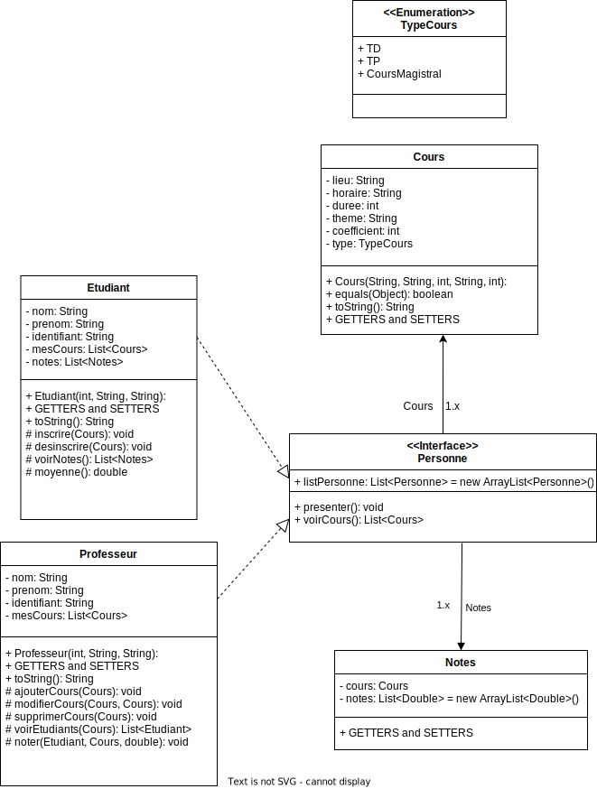

# Système scolaire
 
**Principe de base :**

Dans cet exercice, nous allons modéliser un établissement scolaire
composé de personnes pouvant être soit des étudiants soit des professeurs.
Un étudiant possédera : un nom, un prénom, un identifiant, la liste des
cours auxquelles il est inscrit ainsi que la liste des notes reçues pour
chacun de ses cours. Et pourra se présenter, s'inscrire ou se désinscrire d'un
cours, visualiser ses cours et ses notes ainsi que calculer sa moyenne.
Un professeur, quant à lui, possédera aussi : un nom, un prénom, un
identifiant, ainsi que la liste des cours qu'il propose. Celui-ci pourra se
présenter, visualiser la liste de ses cours, ajouter, modifier ou supprimer un
cours, voir la liste des étudiants inscrits pour un cours donné, ou attribuer
une note à un de ses étudiants.

Un cours sera caractérisé par : un lieu, un horaire, une durée, un thème, un
coefficient et un type (TP / TD / Cours magistral)

**Question :**

1 Représenter le problème suivant sous forme de diagramme de
classe

2 Implémenter les classes Etudiant, Professeur et Cours ainsi que
l'interface Personne, classe mère de Professeur et Etudiant.
Utilisez une énumération pour gérer les types de cours.

3 Répondre via un commentaire dans le fichier en argumentant
votre réponse. Que pensez-vous de l'utilisation d'une interface
pour gérer le concept de personne ?
Ce choix est-il judicieux ?
Pourquoi ?

Le Choix d'une interface est une bonne utilisation ici car elle permet d'utilisé des méthodes par défauts et d'avoir la liste de tous les etudiants accessible par les professeurs grace au mot cles static.
Cependant ce n'est pas selon moi le meileur choix possible.
En effet il n'est pas possible dans une interface d'avoir des variables alors qu'ici les nom, prenom et identifiant et mesCours sont des variables communes dans Etudiant et Professeur.
Et les getters et setters sont ici uniquement des prototypes de part cette limite, alors qu'ils sont identique dans les 2 classes fille et pouraient très facilement être initialisé dans la classe mère.
Il aurrait donc mieux vallu utilisé une classe abstraite cela aurait permis de déclarer les variables nom, prenom et identifiant et mesCours dans la class mere Personne.

4 Proposer un jeu de test dans votre main permettant de tester les
différents scénarios possibles.